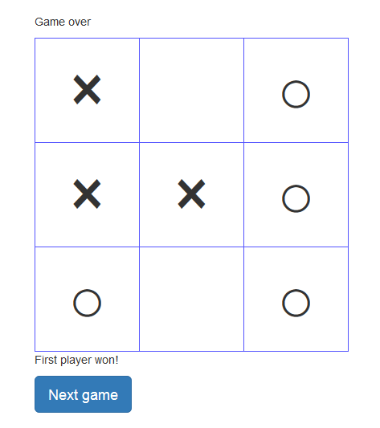

# ticTacToe

Tic Tac Toe app. This program is created for my Javascript skill up.

# How to play

* Install npm, nodejs and MongoDB.

```
git clone https://github.com/nktener0902/ticTacToe.git
```

* Move to this direcotry in your terminal.

  - Windows
  
```
set DEBUG=app:* & npm start
```

  - Mac

```
DEBUG=app:* npm start
```

* Open browser, and http://localhost:3000/
